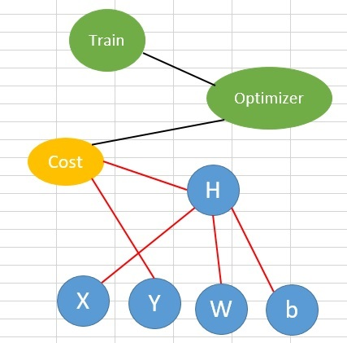
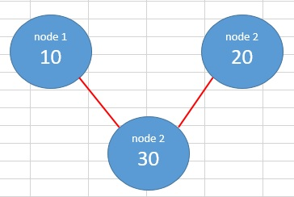

# Tensorflow


## 1. 패키지 설치 및 확인

* jupyter notebook 관리자 권한 실행.

* 패키지 설치 : `pip install tensorflow==1.5.0`

  * 1.x 버전으로 학습한 후,
  * 2.x 버전으로 변경된 부분만 새롭게 학습.
  * 사진 첨부 1

* `jupyter notebook` 실행

* 패키지 설치 확인 : 

  ```python
  import tensorflow as tf
  ```

  * 일반적으로 `tf`로 잡음.
  * 처음에 warning 나오지만, 신경쓰지 말고 다시 실행하면 됨.


## 2. Tensorflow 라이브러리


 다른 패키지, 라이브러리와는 다른 개념이다. 일반적으로는 필요한 함수를 불러서, 필요한 기능을 수행하기 위해 라이브러리를 사용한다.

 텐서플로우는, 전체적인 그래프를 만드는 라이브러리다. 





 Tensorflow는 모든 것을 tensor로 표현한다. tensor의 흐름으로 모든 것을 표현한다고 해서 이름이 Tensorflow다. 각 데이터 node 간 tensor가 흐르며 간선이 형성되고, 연산이 수행된다. 


* 구성요소
* 1) `node` : 수학적 연산, 데이터 입출력 담당.
  * 2) `edge` : `node` 간 연결, 동적 데이터를 노드로 실어 나르는 역할.
  * 3) `tensor` : 다차원 배열 형태의 동적 데이터. 
* 코드 실행 시, **그래프가 만들어짐.**

  * 그냥 출력하면 Tensor가 무엇인지 보여줌.
  * session 이라는 runner 생성하고, run 함수 통해 실행.


## 3. Tensorflow 기초

### 3.1. 상수 출력

* tensor 출력

```python
node1 = tf.constant("Hello World!")

print(node1)
# 실행 결과: node1이 가진 Tensor를 그대로 출력.
Tensor("Const:0", shape=(), dtype=string)
```

* node를 graph로 출력
  * session이라고 불리는 runner 생성.

```python
sess = tf.Session()		# session: tensorflow 생성할 수 있는 주체가 되는 함수.
print(sess.run(node1))
# 실행 결과
b'Hello World'
print(sess.run(node1).decode())
# decode를 통해 b'~' 없이 출력 가능
# 실행 결과
Hello World!
```


### 3.2. 상수 합 구하는 연산 수행

* node, graph 만들기

```python
node1 = tf.constant(10, dtype = tf.float32)
# node1에 저장될 수가, 겉으로는 정수처럼 보이지만,
# 대부분의 연산은 실수를 기반으로 하므로, tensorflow의 data type 중 float32로 지정.
node2 = tf.constant(20, dtype = tf.float32)

node3 = node1 + node2
# 덧셈 연산 수행하는 node 생성
```

* 연산 수행

  * `node3` 실행 시, `node1`, `node2` 모두 실행하고 합하는 작업 수행.

  

```python
sess = tf.Session()
print(sess.run(node3))		# 실행 결과 : 30.0
print(sess.run(node1))		# 실행 결과 : 10.0
print(sess.run([node1, node2]))		# 실행 결과 : [10.0, 20.0]
# 여러 개 실행하려면, list 형태로 수행하면 됨.
print(sess.run([node2, node3]))		# 실행 결과 : [20.0, 30.0]
# 각각의 node 따로 실행
```


### 3.3. 실행 시점에 변수 입력받아 연산 수행

> constant는 상수이기 때문에, 다른 연산을 수행하고 싶다면 각각의 node에 저장된 값을 모두 바꿔야 함.
>
> graph를 만들어 놓고, 실행 시점에 각 node의 값을 입력받아서 결정하면 됨.


* `placeholder` : 입력을 받아들일 수 있는 `node`
  * 입력 없이 바로 data type 명시.
  * 실행 시 실제 값을 명시해줘야 그 값이 들어가서 수행됨.
  * 1) 입력값을 직접 feed하거나, 2) 입력값을 직접 input 받거나.

```python
node1 = tf.placeholder(dtype = tf.float32)
node2 = tf.placeholder(dtype = tf.float32)
node3 = node1 + node2		# 덧셈 연산을 수행하기 위한 node

sess = tf.Session()
result = sess.run(node3, feed_dict = {node1 : 3, node2 : 10})
print("덧셈결과 : {}".format(result))
# 실행할 때 node1과 node2를 입력해야 함.
# node1과 node2의 입력값이 실행되지 않으면, node3도 입력되지 않음.
# feed_dict: 실행할 때 dictionary 형태로 값 입력함.
# dictionary는 {}로 나타내고, key와 value의 쌍으로 나타내어 짐. -> key에 node, value에 입력할 값.

# 실행 결과
덧셈결과 : 13.0
```

```python

sess = tf.Session()
result = sess.run(node3, feed_dict = {node1: input(),
                                      node2: input()})
print("덧셈결과 : {}".format(result))

# 실행 결과
10				(입력)
13				(출력)
덧셈결과 : 23.0
```


