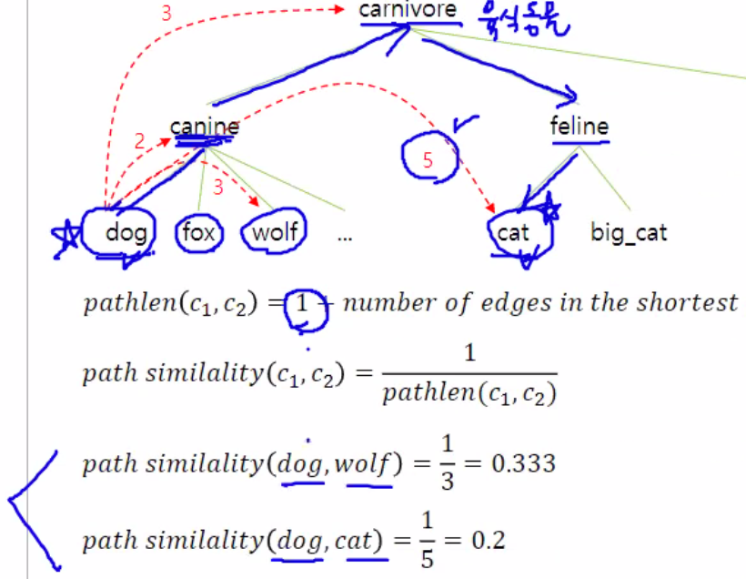

# NLTK


 기본적인 사용법은 다음과 같다.

```python
!pip install nltk
nltk.download()
```


## 1. Corpus


 NLTK 패키지에 사용할 수 있는 여러 원문 텍스트들이 있다.

* `fileids()` : 코퍼스 파일 조회.
* `raw()` : 텍스트 문서 원문 조회.
* `words()` : 단어 단위로 조회. 리스트 반환.
* `sents()` : 문장 단위로 조회. 리스트 반환.
* `FreqDist()` : 빈도 확인
* `ConditionalFreqDist()` : 조건을 설정하여 빈도 분포 확인.


1. `gutenberg` : 영문 소설 텍스트 데이터. 

   * 직접 gutenberg 사이트에서 읽어 와 NLTK 텍스트 형태로 변환할 수도 있다. 변환된 문서는 `nltk.text.Text` 클래스 형태이다.

   

   ```python
   from urllib import request
   import nltk
   
   # 읽어 오기
   url = "http://www.gutenberg.org/files/..."
   req = requests.urlopen(url)
   text = req.read().decode('utf-8')
   
   # 토큰 분리
   tokens = nltk.word_tokenize(text)
   nltk_text = nltk.Text(tokens) # NLTK 텍스트 형태로 변환
   ```


2. `Webtext` : 영화 대본, 게시판.

3. `nps_chat` : 인터넷 일반 chat 데이터. XML 형식으로 되어 있다.

4. `Brown` : 브라운대. 뉴스, 편집 기사 등 카테고리 별로 분류되어 있는 전자 문서.

   * 카테고리별로 단어의 분포를 확인할 수 있다. 확인하고 싶은 카테고리와 단어를 튜플 형태로 묶어준 뒤, 출력하면 된다.

   

   ```python
   cfd = nltk.ConditionalFreqDist(
   	(genre, word)
   	for genre in brown.categories()
   	for word in brown.words(categories=genre)
   )
   
   cfd.conditions()
   >>> ['adventure', 'belles_lettres', 'editorial', 'fiction', 'government', 'hobbies', 'humor', 'learned', 'lore', 'mystery', 'news', 'religion', 'reviews', 'romance', 'science_fiction']
   
   cfd['adventure'] # adventure 장르에 가장 많이 등장하는 단어 빈도 확인
   >>> FreqDist({'.': 4057, ',': 3488, 'the': 3370, 'and': 1622, 'a': 1354, 'of': 1322, 'to': 1309, '``': 998, "''": 995, 'was': 914, ...})
   
   ```


5. `reuters` : 90개의 주제로 분류되어 있는 10788개의 뉴스 문서. 데이터가 학습용(`training/`)과 시험용(`test/`)으로 분류되어 있다.

6. `inaugural` : 대통령 취임 연설문.

   * 연도 별로 `america`와 `citizen` 단어가 몇 번 사용되었는지 빈도 변화 관찰.

   ```python
   import nltk
   from nltk.corpus import inaugural
   
   cfd = nltk.ConditionalFreqDist(
   	(target, fileid[:4]) # fileid에 `.txt` 확장자 제거
   	for fileid in inaugural.fileids()
   	for w in inaugural.words(fileid)
   	for target in ['america', 'citizen']
   	if w.lower().startswith(target)
   )
   ```

   

7. 영어 단어 목록 : `nltk.corpus.words`
8. 사람 이름 목록 : `nltk.corpus.names`
   * 남자 이름 : `names.words('male.txt')`
   * 여자 이름 : `names.words('female.txt')`


## 2. Stopwords


 영어의 불용어를 확인할 수 있다.


## 3. Wordnet


```python
nltk.download('wordnet')

from nltk.corpus import wordnet as wn
```


### 3.1. 어휘 집합 확인

```python
for synset in wn.synsets('home'):
    print(f"Lemma: {synset.name()}")
    print(f"Definition: {synset.definition()}")
    print(f"Thesaurus: {synset.lemma_names()}")
    print(f"Examples: {synset.examples()}")
    print(" ")
```


* `.name()` : 어휘 분류 조회.
* `.definition()` : 어휘 의미 조회.
* `.lemma_names()` : 어휘 집단에 속한 단어들의 원형.
* `.examples()` : 예문. *없는 경우*도 있으므로 주의!


### 3.2. 어휘 관계 확인

* `.hyponyms()` : 하위어 조회, `.hypernyms()` : 상위어 조회.
* `part_meronyms()`, `substance_meronyms()`, `part_holonyms()`, `entailments()`.
* 최상위 단어로부터의 단어 경로 : `hypernym_paths()`


### 3.3. 유사도 측정


* `.path_similarity()`로 유사도를 측정한다.





 트리 구조로서 유사도를 측정한다. 트리 구조로 나타낸 단어에서 목적지 단어까지 가는 가장 짧은 경로를 찾고, 그 경로에 있는 정점들의 개수를 센다. 이후 자기 자신까지 하나로 쳐서 1을 더한다.


### 3.4. 깊이 측정


* `.min_depth()`로 깊이를 측정한다.

```python
>>> cat = wn.synset.('cat.n.01')
>>> cat.hypernym_paths()
# [[Synset('entity.n.01'), Synset('physical_entity.n.01'), Synset('object.n.01'), Synset('whole.n.02'), Synset('living_thing.n.01'), Synset('organism.n.01'), Synset('animal.n.01'), Synset('chordate.n.01'), Synset('vertebrate.n.01'), Synset('mammal.n.01'), Synset('placental.n.01'), Synset('carnivore.n.01'), Synset('feline.n.01'), Synset('cat.n.01')]]
>>> cat.min_depth
# 13

```


 루트 단어까지의 path를 찾아 몇 단계를 거쳐야 하는지 센다. 얕을수록 일반적인 의미를, 깊을수록 특정한 의미를 갖는다. 


## 4. Stemmer


 어간을 분석한다. 다음과 같은 종류의 분석기가 있다.

* `.PorterStemmer()`
* `.LancasterStemmer()`


