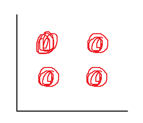
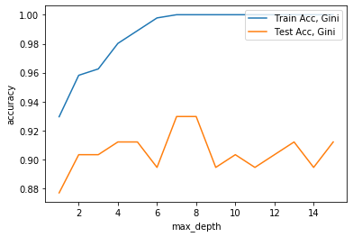
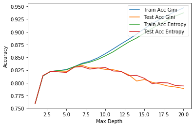

# [머신러닝]

## 1. 분류(Classification)

### 1.2. Decision Tree

> 참고: 조성현 강사님 강의 자료, [ratsgo's blog](https://ratsgo.github.io/machine learning/2017/03/26/tree/).

 특정 기준에 따라 데이터에 구분선을 그어 나가며 분류하는 모델이다.(여기서는 분류 모델로 설명하지만, 회귀에도 사용할 수 있다.) 여러 개의 데이터를 가장 잘 구분할 수 있는 질문을 기준으로, 구분선을 긋는다. 

 이렇게 여러 가지 규칙을 순차적으로 적용하면서 데이터를 분할하다 보면, 다음과 같이 데이터를 나누는 기준을 트리 형태로 나타낼 수 있다.

 

* 구분선(decision boundary): 의사결정선. 데이터를 분류하기 위해 긋는 선.
* 분기: 구분선을 기준으로 의사결정나무가 나누어지는 것.
* 리프 노드: 마지막 노드. 

 새로운 데이터가 들어올 때마다 의사결정선을 긋는다. 계속해서 의사결정선을 그어 나가면서, 가장 잘 분류될 때까지 과정을 반복한다.

 

#### 분할 알고리즘

 데이터를 가장 잘 분류하기 위해 최적의 트리 분할 선택 기준을 고르는 것이 중요하다.  분할 선택 기준을 선정할 때는, 불순 척도, 즉 데이터가 섞인 정도가 덜하도록 고르는 것이 좋다. 이 때 불순 척도를 측정하는 지표로, **엔트로피 지수**와 **지니 지수**의 두 가지가 사용된다.

.png)

 1부터 c까지의 i는 클래스를 나타낸다

 다음의 경우(동그라미 2개, 엑스 2개) 엔트로피와 지니 계수를 계산해 보자.

* 엔트로피

$$
G_E = -(\frac {1} {2} \times log_2 \frac {1} {2} + \frac {1} {2} \times log_2 \frac {1} {2})
$$

* 지니

$$
G_G = 1 - (\frac {1} {2})^2 - (\frac {1} {2})^2
$$

 계산해 보면 엔트로피 지수는 1, 지니 지수는 0.5가 됨을 알 수 있다. 각각의 수치는 데이터가 가장 불순할 때 나올 수 있는 수치들이다. 반대로 다음과 같이 데이터가 모두 순수한 경우는, 동일한 방법으로 계산하면 엔트로피 지수와 지니 지수가 모두 0이 된다.

 이를 바탕으로 지니지수와 엔트로피 지수로 측정한 불순 척도의 분포를 그래프로 나타내면 다음과 같다. 둘 모두 데이터가 절반씩 섞여 있을 때 불순 척도가 최대가 된다.

 분할 시에는 어떠한 기준을 선택하든 불순 척도가 감소하도록 선택하는 것이 좋다. 불순도가 감소하는 것을 **정보 획득**이라고 한다. 다시 말하면, 정보 획득이 최대량이 되도록 하는 것이 좋다.

 분할 선택의 과정을 다음의 그림을 예로 들어 설명하면 다음과 같다. (지니 지수를 기준으로 설명한다.)

 초기 분할 선을 `x = a`로 선택하거나(좌우 분할), `y = A`로 선택한다(상하 분할)고 하자.

 좌우 분할로 선택하는 경우, 왼쪽 영역의 지니 지수는 0.153, 오른쪽 영역의 지니 지수는 0.473이 된다. 각 경우의 지니 지수를 가중평균하면, 좌우의 선을 초기 분할선으로 선택하는 경우 지니 지는 0.372가 된다. 완전히 불순할 때의 지니 지수가 0.5임을 감안한다면, 분할을 통해 0.128(=0.5-0.372)의 정보량을 획득했다고 볼 수 있다. 

 같은 방식으로 상하 분할선을 선택한다고 하면, 위쪽 영역의 지니지수는 0.444, 아래쪽 영역의 지니 지수는 0.484가 된다. 가중평균한 값은 0.462이므로, 분할을 통해 0.038의 정보량을 획득했다.

 정보 획득량을 계산할 때 가중평균을 취하는 이유는, 데이터의 수에 영향을 받지 않도록 하기 위함이다. 극단적으로 데이터가 1개만 존재하도록 분할선을 긋는다면, 가장 순수한 데이터 영역이 만들어질 것이다. 이처럼 데이터의 수를 적게 해놓고 순도가 높다고 하는 것을 방지하기 위해 가중평균의 과정이 필요하다.

 이렇게 초기분할을 하는 경우를 비교했을 때, 불순도가 더 낮아지고, 정보량 획득이 많아지는 첫 번째 방법으로 분할선을 선택하는 것이 좋다. 

 이렇게 **정보 획득량이 더 많아지도록** 계속해서 트리를 분기해 나가는 것이 의사결정나무의 원리이다. (물론 무수히 많은 분기의 과정을 거칠 수 없기 때문에, 내부적으로 `quantile`  등의 알고리즘을 사용하여 분기한다.)

#### 특징

* 분류나 예측의 근거를 알 수 있으므로, 결정 과정에 대한 이해가 쉽다.
* 데이터의 차원이 높아져도(feature가 많아지더라도) 분류에 중요한 feature들을 제외할 수 있으므로, feature 선정에 크게 신경쓸 필요가 없다.

#### 모델 학습

 다른 사이킷런 모델과 마찬가지로 다음의 과정을 거쳐 모델을 학습한다.

* `model.build` 
* `model.fit` : 트리를 생성한다. 지니 지수나 엔트로피 지수 등 불순 척도를 계산하고, 학습 데이터를 이용해서 학습 데이터로 트리를 만든다.
* `model.predict` : 생성한 트리를 바탕으로 새로운 데이터가 어느 영역에 속할지(회귀의 경우에는 어떤 값을 가질지) 예측한다.

 모델의 파라미터 중 중요한 것으로는 정보량 획득 계산의 기준을 무엇으로 할 것인지의 `criterion`과, 트리를 어느 단계까지 생성해 나갈 것인지의 `max_depth`가 있다.

 `max_depth`의 경우, default 값은 `None`이다. 마지막 노드에 데이터가 1개 남을 때까지 트리를 분기해 나간다. 이 경우, 당연히 마지막 노드에 데이터가 1개 남기 때문에, pure해진다.

#### 과적합

 breast cancer 데이터 실습 결과를 보자. 

|                             Gini                             |                           Entropy                            |
| :----------------------------------------------------------: | :----------------------------------------------------------: |
|  |  |

  train set에 대한 정확도가 어느 순간 이후 100%가 되는 것을 볼 수 있다. 자신의 데이터로 트리를 구성한 후, 그 데이터를 대입하니 잘 맞출 수밖에 없다.

 트리의 깊이가 깊어질수록, 의사결정나무 알고리즘은 맨 끝의 leaf node가 1개 남을 때까지 트리를 만들어 나간다. 깊이가 무한해질수록 순도가 높아지고, 학습 데이터를 정확히 맞출 수밖에 없는 구조라는 말이다. 그래서 max_depth를 늘리며 학습을 진행해 나갈수록 train set에 대한 정확도는 높아질 수밖에 없다.

 그렇다면 이렇게 train accuracy가 높아지는 것이 좋은 상황일까?  그렇지 않다. **과적합**된 상황이다.

  뎁스가 깊어질수록 학습 데이터는 잘 설명하는데, 새로운 데이터는 제대로 맞추지 못한다는 의미다. 알고리즘이 학습 데이터를 달달 외워 버리는 상황이다. **적절한 뎁스가 어디인지** 결정하는 일이 매우 중요하다.

 income 데이터로 진행한 실습을 보더라도, 뎁스가 깊어질수록 train accuracy는 100%에 가까워지지만, test accuracy는 7 부근에서 꺾이는 것을 볼 수 있다.

